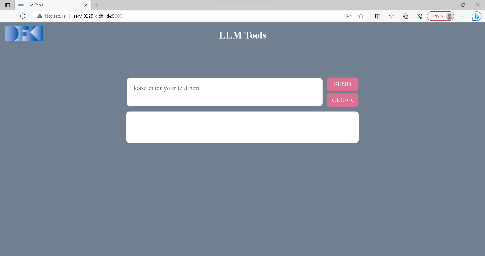

# LLM Tools

LLM tools are

... a unified interface to access LLMs, both remote (such as OpenAI models) and self-hosted (on our Slurm cluster).

... a starter skript to easily start the models on Slurm.

... helpers to interact with the LLMs.


## Table of contents
- [LLM Tools](#llm-tools)
  - [Starting an LLM on the DFKI Cluster](#starting-an-llm-on-the-dfki-cluster)
  - [Installation](#installation)
  - [Usage](#usage)
- [LLM Tools web user interface](#llm-tools-web-user-interface)
- [batch\_processor](#batch_processor)
  - [Usage](#usage-1)

## Starting an LLM on the DFKI Cluster

Clone the repository. Use an example slurm starter skript from the [llm models table](https://docs.google.com/spreadsheets/d/1F6T_ZPiEomYrfvpy64GUmuO0CiSQ4LrZrgM4BjSLmKA/edit#gid=0). Then make the starter skript executable and execute it (replace __PATH__ with your installation directory)

```
chmod +x __PATH__/src/slurm/run_llm.sh
./usrun.sh -p A100-40GB --gpus=1 --time 08:00:00 --mem 100GB __PATH__/src/slurm/run_llm.sh vicuna7b
```

Finding out the URL of the API or the user interface is currently a bit fiddly. On the slurm cluster, run

```
$ squeue |grep YOUR_USER_NAME
709485_3     batch     G_w2  YOUR_USER_NAME  R   12:03:17      1 serv-9209
```

It shows a list of all your runnig slurm jobs. On the right you can see your host name. Ping it to get the IP address:

```
$ ping serv-9209
PING serv-9209.kl.dfki.de (192.168.92.189) 56(84) bytes of data.
64 bytes from serv-9209.kl.dfki.de (192.168.92.189): icmp_seq=1 ttl=63 time=0.137 ms
```

Here you can see your nodes IP address. The web UI and the API run on this IP address on port 5000, in the example `http://192.168.92.189:5000`.

## Installation

1. Create a virtual environment, e.g. with Conda. We recommend Python 3.9.6.
2. Install the requirements: `pip3 install -r requirements.txt`

## Usage

You can start the command line tool to do a oneshot interaction with the LLM. Or you can start an HTTP API. Here are some examples:

**Get help**

```
$ python3 -m llm.run --help
usage: LLM Tools [-h] --wrapper LLM [--input_str INPUT_STR] [--mode {http_api,oneshot}]

optional arguments:
  -h, --help            show this help message and exit
  --wrapper LLM             Specify which LLM you want to load.
  --input_str INPUT_STR
                        Specify input document. For mode=oneshot.
  --mode {http_api,oneshot}
```

**One shot interaction with the Dummy LLM**

```
python3 -m llm.run --wrapper dummy_llm --mode oneshot --input_str="hallo"
```

**Start the HTTP API with the Dummy LLM** 

```
python3 -m llm.run --mode http_api --wrapper dummy_llm
```

Send a post request to the Dummy LLM:

```
curl -X POST -d '{"doc": "hello world"}'  -H "Content-Type: application/json" http://localhost:5000/api/generate
```

Call the dummy LLM from a remote LLM:

```
python3 -m llm.run --wrapper http --mode oneshot --input_str="hallo" --api_url "http://localhost:5000/api/generate"
```

**HTTP API interaction with OpenAI Davinci**

```
export OPENAI_API_KEY=...
python3 -m llm.run --wrapper openai --model text-davinci-003 --mode http_api
```

**Adding a new LLM to llm_tools**

```
Inside llm_registry.py file, add a new entry to the llm_registry dictionary, 
mapping a unique name for your LLM to a lambda function that creates an instance of your LLM class.
Inside my_llm.py, define a class that inherits from the LLMWrapper abstract class. 
This class will represent your LLM implementation.
You have successfully added a new LLM to the llm_tools.
```

## LLM Tools web user interface

```
There is a Web user interface available to interact with llm.
Start the HTTP API with any desired llm using the --http_api parameter. This will also start the service of web interface.
You can open web UI through your browser using local IP (127.0.0.1:5000).
You can type in any text in the textbox that you want to sent to llm and press send. 
The result will be displayed in the lower white box.
```


## batch_processor
Tool for processing CSV files with llm. 
### Usage
Help:
```
$ python batch_processor.py -h
usage: batch_processor [-h] [--api API] [-i INPUT_FILE] [-o OUTPUT_FILE] [-ic INPUT_COLUMN] [-oc OUTPUT_COLUMN] [--max_new_tokens MAX_NEW_TOKENS] [--temperature TEMPERATURE]

Process a csv data in api

options:
  -h, --help            show this help message and exit
  --api API             API URL; defaults to 'http://localhost:5000/api/generate'
  -i INPUT_FILE, --input_file INPUT_FILE
                        input file path; defaults to 'input.csv'
  -o OUTPUT_FILE, --output_file OUTPUT_FILE
                        output file path; defaults to 'output.csv'
  -ic INPUT_COLUMN, --input_column INPUT_COLUMN
                        name of the input data column; defaults to 'input'
  -oc OUTPUT_COLUMN, --output_column OUTPUT_COLUMN
                        name of the output data column; defaults to 'output'
  --max_new_tokens MAX_NEW_TOKENS
                        maximum model return size in tokens; defaults to 100
  --temperature TEMPERATURE
                        model output temperature between 0 and 2, defines how random is output; defaults to 1
```
Each entry in an INPUT_COLUMN of INPUT_FILE will be sent to API.

OUTPUT_FILE is a copy of an input file with a new column OUTPUT_COLUMN (default = 'output') which contains API responses. 

Make sure to set MAX_NEW_TOKENS as needed. 100 Tokens is only 1 paragraph maximum.

If input file already has an 'output' column - only rows with empty output will be processed. Processing may be interrupted(via CTRL+C in UNIX) at any point and continued later by using an output file as an input. 

Example usage
```
$ python3.11 batch_processor.py -i output.csv
processing output.csv: 100%|########################################| 60/60 [00:00<00:00, 673.91rows/s]
Processed 60 rows in 0.08912 seconds. (673.3 rows/second)
Saved results into output.csv
```
